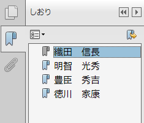

jletteraddress.cls
==================

A document class of LaTeX for address side of the Japanese letter.

You can create the address side of the Japanese letter with latex.  The
address are listed in the PDF Bookmarks if you use dvipdfmx.




Usage
-----

First specify a document class in the top of the TeX document.

``` tex
\documentclass[]{jletteraddress}
```

Then, describe the sender's informations (name, postcode, and address)
in the preamble as following:

``` tex
\sendername{Taro Sender}                   % Sender's name
\senderaddressa{1-2-3, Sender-city, Japan} % Sender's address 1
\senderaddressb{#999 Sender Mansion}       % Sender's address 2
\senderpostcode{9999999}                   % Sender's postcode
```

Now you can add the receiver's information in the document.  To add the
receiver's information, use `\addaddress` macro to specify the
receiver's name, postcode, and address between `\begin{document}` and
`\end{document}`.

``` tex
\begin{document}
  \addaddress
      {Receiver name}
      {Receiver prefix}
      {Receiver postcode}
      {Receiver address 1}
      {Receiver address 2}
\end{document}
```


For example of use, see example.tex.


Licence
-------

MIT
